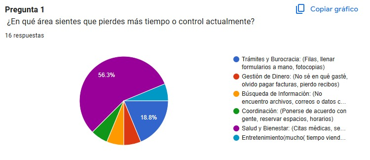
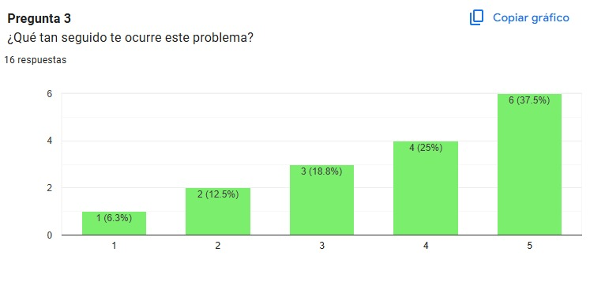
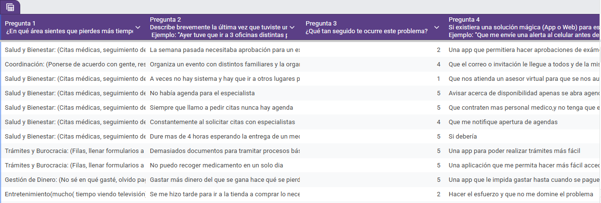

## Taller: De la Queja a la Arquitectura ##

# **Proyecto: SaludActiva** #

## 1. El Problema (Discovery) ##

* ¿Qué duele?: ["Siempre que llamo a pedir citas nunca hay agenda, especialmente para especialistas".]

* Frecuencia: [Es un problema recurrente (4/5)]

* La Solución Soñada: ["Una aplicación que me avise cuando haya citas disponibles y que permita hacer solicitudes de citas, exámenes y medicamentos de manera online".]

## Resultado de la sonda: ##
Se realizó la encuesta a 16 personas, de las cuales el 56,3% identificaron el área de Salud y Bienestar como el principal problema. La mayoría de los encuestados manifestó dificultades para solicitar citas médicas, especialmente con especialistas, debido a la falta de agenda disponible y a los procesos lentos y repetitivos. Esto demuestra que la gestión de citas médicas es una de las mayores fuentes de pérdida de tiempo y frustración para los usuarios.

[Formulario  de la encuesta](https://docs.google.com/forms/d/e/1FAIpQLSdpyU8u9NE0KlsyTASYh1NekPDXXqA_KWoC-4amhvOXkxieFQ/viewform?usp=header)

[Resultados de la encuesta](https://docs.google.com/spreadsheets/d/1e8eew9FBKeJhgPamUKih0T7pUUilkViGdlndRy2b74I/edit?usp=sharing)

## 2. Definición Funcional

### Historia de Usuario Principal (User Story) ###

* Como paciente del sistema de salud, quiero recibir notificaciones cuando se liberen citas médicas y poder solicitarlas en línea, para no tener que llamar o asistir presencialmente todos los días.

### Criterios de Aceptación (Definition of Done) ###

▪ El sistema debe funcionar correctamente en dispositivos móviles y computadores, adaptando su diseño al tamaño de la pantalla.

▪ El usuario debe poder crear una cuenta e iniciar sesión de manera segura.

▪ El usuario debe recibir una notificación cuando se libere una cita médica o cuando un especialista abra agenda.

▪ El usuario debe poder solicitar una cita médica desde la plataforma sin necesidad de realizar llamadas o desplazarse físicamente.

▪ El usuario debe poder visualizar el estado de sus solicitudes de citas (pendiente, aprobada o rechazada).

▪ El sistema debe guardar y mostrar correctamente la información de cada usuario y sus citas.

### Requisitos Funcionales (Draft Técnico) ###

RF-01: El sistema debe permitir el registro de nuevos usuarios con datos básicos como nombre, correo electrónico y contraseña.

RF-02: El sistema debe permitir el inicio y cierre de sesión de los usuarios de manera segura.

RF-03: El sistema debe conectarse a una base de datos para almacenar la información de los usuarios, citas médicas y solicitudes.

RF-04: El sistema debe permitir consultar en tiempo real la disponibilidad de citas médicas por especialidad.

RF-05: El sistema debe permitir que los usuarios soliciten citas médicas desde la plataforma.

RF-06: El sistema debe permitir consultar el estado de las solicitudes de citas.

RF-07: El sistema debe enviar notificaciones automáticas cuando se liberen nuevos cupos o cuando una cita cambie de estado.

RF-08: El sistema debe permitir al usuario gestionar sus citas (ver, cancelar o reprogramar).